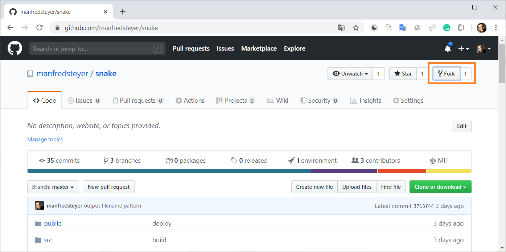
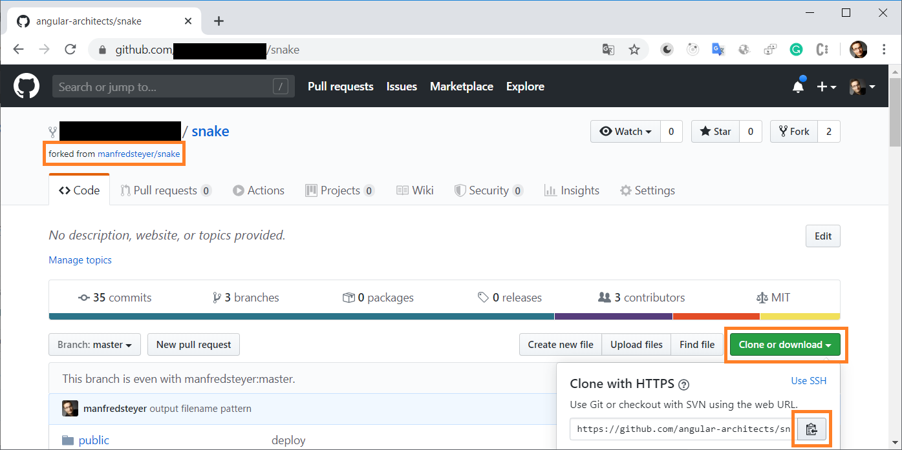
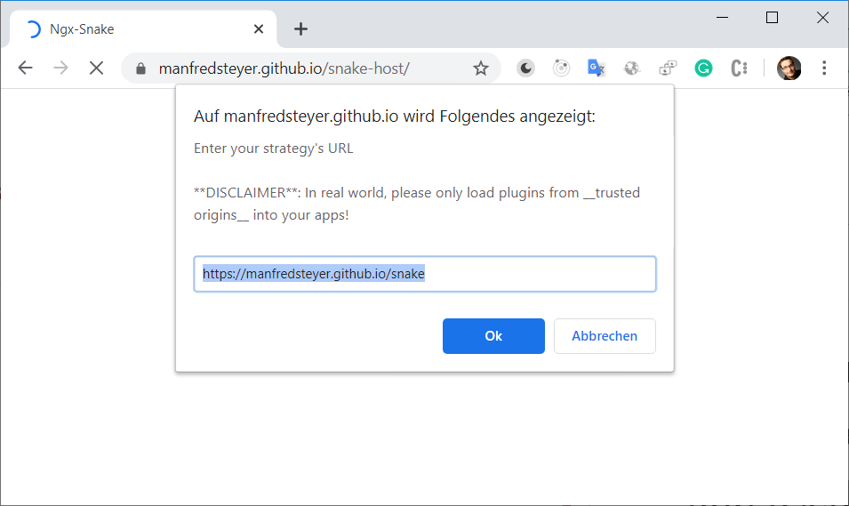

# ngx-Snake Module Federation Challenge

## Credits
This is a fork of https://github.com/SamirHodzic/ngx-snake.

Big thanks for this nice example!

## TLDR

- Fork this repo and implement your own strategy for navigating the snake (**use yarn!!**)
- Compile it as a Module Federation (``yarn build``) remote and publish it to GitHub pages until **June, 18th** (there is a ``deploy.js`` node script for this)
- Fill out [this form to hand in your solution](https://tinyurl.com/federation-challenge)
- Join the [Award Ceremony](https://www.meetup.com/de-DE/ngCopenhagen/events/270827005)


## Goal
The goal of this contest is to write a strategy navigating the snake. Maximize the amount of fruits it is eating during the **first 500 moves**:

- In the case of a tie after 500 moves, we will increase this limit.

- The **game mode** used for the evaluation is ``Obstacles`` (just play the Game to find out what this means ;-)).

## Get into the right mood

Before getting started, **play** the [interactive version](https://samirhodzic.github.io/ngx-snake/) of snake to get into the right mood:

https://samirhodzic.github.io/ngx-snake/
	

## Getting started

To take part in this challenge, you need to **fork** this repository:

1. **Fork** this repo to be capable of providing your own implementation.
   
    

2. Copy **your fork's URL:**

	

3. Clone your fork:

	```
	git clone https://github.com/<your-account>/snake.git
	```

4. Install all dependencies with **yarn** (**not npm**!). 
   
   We really need yarn here to prevent that the two used versions of webpack (webpack 5 for Module Federation and webpack 4 for the Angular CLI) collide.

	**Remarks**: If you don't have yarn, you can easily install it with ``npm i -g yarn``.

	```
	cd snake
	yarn
	```

5. Start the project and see the very simple baked-in strategy for controlling the snake in action:

	```
	yarn start
	```

	**Hint:** Start with the easiest game option called _without walls_:

	

6. Now it's your turn: Open the file ``custom.strategy.ts`` and implement your own strategy for navigating the snake:
   
  - The method ``step`` is called before each move. It gets the game's state like the snake's position, the fruit's position and potential walls (not every game mode has a walls) and returns the new direction of the snake (up, down, left, right):
   
	```
	step(context: Context): SnakeDirection { ... }
	```

  - Please only use TypeScript code and no Angular-specifics for this strategy as using Module Federation with Angular is currently not possible (without some tricks we've used in our PoCs).


## After coding: Publish your solution

1. Commit and push the source code to your repo:
   
   ```
   git add *
   git commit -m "your meaningful commit message"
   git push
   ```

3. Compile your strategy into a Module Federation Remote:

	```
	yarn build
	```

4. Deploy your strategy to GitHub Pages by calling the preexisting ``deploy.js`` script in your project's root:

	```
	node deploy.js
	```

5. Assure yourself that the deployment worked by navigating to:

	```
	https://<github-user-name>.github.io/snake
	```

	If everything worked, you should see a simple welcome page:

	

	You can ignore the link ;-)


## Test your implementation within our snake app

1. Navigate to https://manfredsteyer.github.io/snake-host/

2. Enter the location of your strategy:

	

3. See your strategy in action.

	**Hint:** If your strategy isn't picked up, try a hard reload (``CTRL+F5``).

## Hand-in your solution

Fill out [this form](https://tinyurl.com/federation-challenge) until Thu, June, 18th 2020:

https://tinyurl.com/federation-challenge

## Award Ceremony

The Award Ceremony takes place during the next [ngCopenhagen Meetup](https://www.meetup.com/de-DE/ngCopenhagen/events/270827005). There, we'll present the best 3 received strategies. 